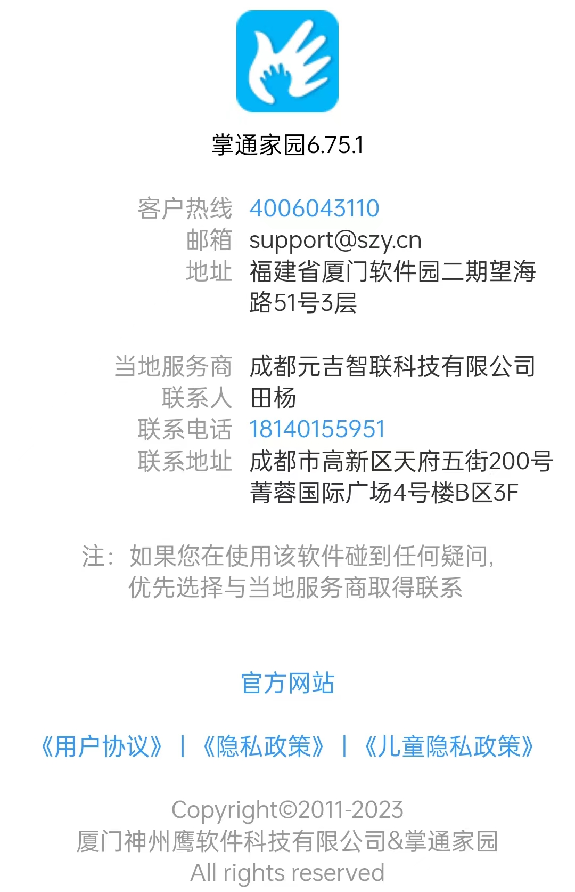
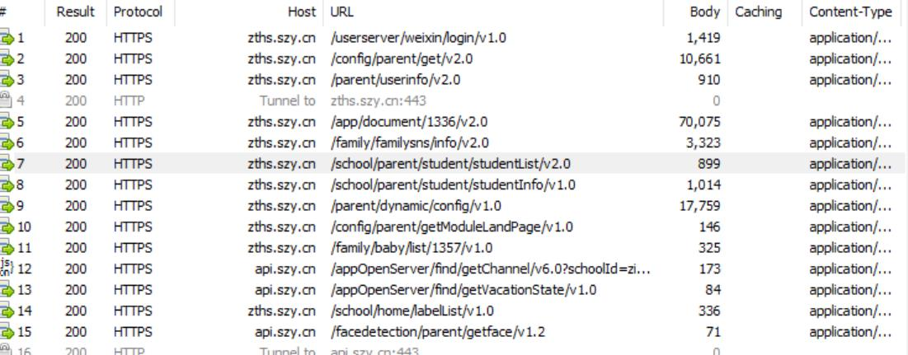

### 通过 groovy 爬取幼儿园App照片视频

此项目作为基于groovy 接口爬虫的案例，基于多线程+groovy+hutool+logback实现的爬虫。

上图为掌通家园App的版本信息。

作为孩子的家长，娃娃在幼儿园的一些珍贵照片老师都通过掌通家园发布在网络上。这些照片我们只有通过APP才能看到。

由于本人有强大的NAS系统做存储支持，于是产生了一个项目就是爬取这些照片信息到本地NAS存储。

### 整体思路

1、通过http（s）代理监听app发送的http请求信息；

   这个步骤是小白用户获取token和jsessionid的都要使用的。

2、通过PostMan测试这些获取token和用户信息查询掌通家园在园时光列表；

  通过数据结构分析， 上拉和 下拉方式加载照片，一拉20条数据，每条数据包含多个图片和单个视频。

3、新建java maven结构项目，加入groovy-all + hutool-all + logback；
    
   通过实现图片下载器、视频下载器，针对不通的数据结构做对应的下载处理方案。下载器内部通过CountDownLatch 控制并行下载资源。由于一组图片的数量不会太多，这些的并发没有做限制。
通过线程池开启50组线程来同时下载，确保资源的合理使用。

4、开始编码利用groovy的模板语法构建参数、hutool提供的http工具请求api接口+download文件；

通过代码爬取了47GB的照片和图片，从孩子入园到转学后两年多时间的珍贵照片。

### 发现的问题

掌通家园app部分接口不需要登录也可以访问，如果不法分子了解到这些schoolId和classId后，可以批量拉取儿童们的照片。

当然本人只拉取了我们家孩子的照片，作为留念使用，未来孩子长大了给孩子看看小时候的照片。

